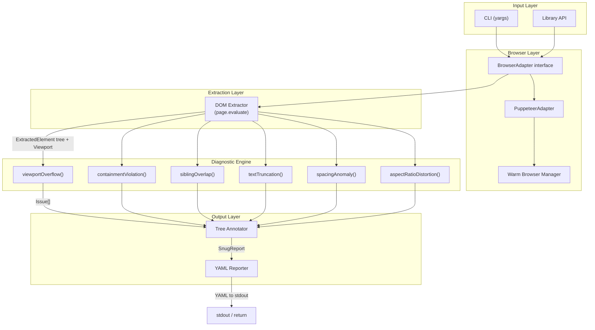
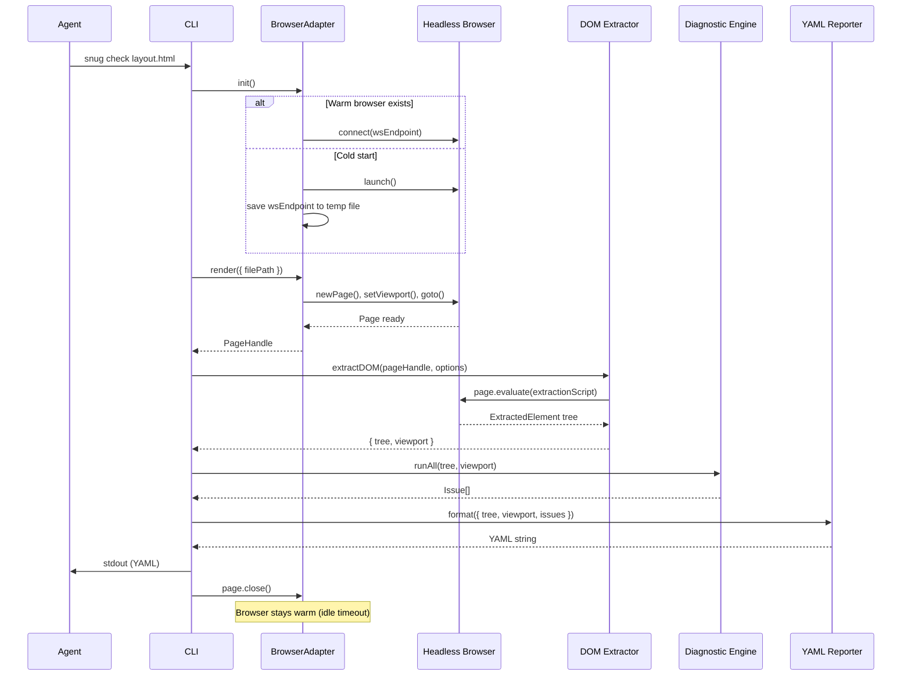
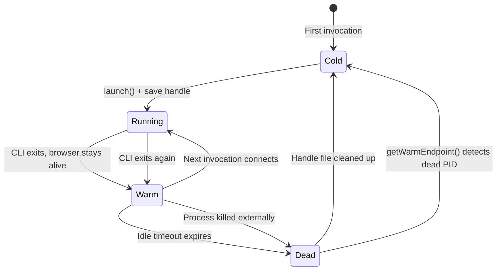

# Snug — High-Level Design

## 1. System Overview

**Snug** is a lightweight layout diagnostics tool built for AI agents. It answers a simple question: *"Does this generated HTML look right?"* — without screenshots or vision models.

Snug renders HTML in a headless browser, extracts the bounding-box geometry of every semantic DOM element in a single `page.evaluate()` call, runs pure-math diagnostic checks over the extracted data, and returns a structured YAML report to stdout. An agent reads the report, identifies spatial problems (overflow, overlap, truncation, spacing outliers), and applies targeted CSS fixes using the actionable selectors Snug provides.

**Design Principles**

| Principle | Implication |
|---|---|
| Math, not pixels | Diagnostics are arithmetic over bounding rectangles — no image diffing, no vision API calls. |
| Single-pass extraction | One `page.evaluate()` round-trip gathers everything. No sequential DOM queries. |
| Agent-first output | YAML report with a bird-view AST tree and inline issue annotations. Selectors are directly usable in CSS fixes. |
| Warm-start iteration | Agents iterate. The browser stays alive between checks to avoid repeated cold-start costs (~1s down to ~50ms). |
| Pluggable browser | The core pipeline is browser-engine agnostic. Puppeteer ships as the default; the adapter interface permits Playwright or others. |
| Pure diagnostic core | The diagnostic engine is a set of pure functions over geometry data with no browser dependency, making it trivially unit-testable. |

---

## 2. Architecture Diagram





---

## 3. Component Design

### 3.1 CLI Entry Point

**File:** `src/cli.ts`

**Responsibility:** Parse command-line arguments, orchestrate the pipeline, handle errors, write YAML to stdout, set exit codes.

```typescript
// CLI command structure
// snug check [file] [options]

interface CLIArgs {
  file?: string;
  stdin?: boolean;
  baseUrl?: string;
  depth?: number;
  width?: number;
  height?: number;
  keepAlive?: number;
}

// Exit codes
// 0 — no issues found (or only info-level)
// 1 — issues found (warnings or errors)
// 2 — runtime error (file not found, browser crash, etc.)
```

**Dependencies:** `yargs`, all pipeline components.

---

### 3.2 Browser Adapter

**Files:** `src/browser/adapter.ts`, `src/browser/puppeteer.ts`, `src/browser/warm.ts`

**Responsibility:** Provide a browser-engine-agnostic interface for rendering HTML and executing in-page scripts.

```typescript
interface BrowserAdapter {
  init(): Promise<void>;
  render(input: RenderInput): Promise<PageHandle>;
  dispose(): Promise<void>;
}

interface RenderInput {
  filePath?: string;
  html?: string;
  baseUrl?: string;
  viewport?: Viewport;
}

interface PageHandle {
  evaluate<T>(fn: string | (() => T)): Promise<T>;
  evaluateWithArgs<T, A extends unknown[]>(
    fn: string | ((...args: A) => T),
    ...args: A
  ): Promise<T>;
  viewport(): Viewport;
  close(): Promise<void>;
}
```

**Key Behaviors (PuppeteerAdapter):**
- `init()`: Attempts warm connection first (reads `$TMPDIR/snug-browser.json`), falls back to cold launch.
- `render()`: Opens a new tab, sets viewport, navigates (file path via `file://` URL or `setContent` for raw HTML), waits for `networkidle0` + `document.fonts.ready`.
- `dispose()`: If this process owns the browser, closes it and cleans up the temp file. If connected to a warm instance, merely disconnects.
- Idle timeout (`keepAliveMs`): Schedules browser closure after N ms of inactivity. Timer is `unref()`'d so it does not keep the Node process alive.

---

### 3.3 Warm Browser Manager

**File:** `src/browser/warm.ts`

**Responsibility:** Persist and retrieve browser WebSocket endpoints across CLI invocations.

**Protocol:**
```
$TMPDIR/snug-browser.json
{
  "wsEndpoint": "ws://127.0.0.1:9222/devtools/browser/...",
  "pid": 12345,
  "createdAt": 1711234567890
}
```

```typescript
function getWarmEndpoint(): Promise<string | null>;
function saveWarmHandle(wsEndpoint: string, pid: number): Promise<void>;
function cleanWarmHandle(): Promise<void>;
```

**Liveness Check:** Before returning a warm endpoint, `getWarmEndpoint()` sends `process.kill(pid, 0)` to verify the browser process is still alive. If the signal fails (ESRCH), the stale handle is cleaned up and `null` is returned.

---

### 3.4 DOM Extractor

**File:** `src/extractor/extract.ts`

**Responsibility:** Execute a single self-contained function inside the browser page context that traverses the DOM tree and returns structured geometry data.

```typescript
async function extractDOM(
  page: PageHandle,
  options?: ExtractionOptions,
): Promise<{ tree: ExtractedElement; viewport: Viewport }>;
```

**In-page extraction rules:**
1. Start at `document.body`, recurse depth-first.
2. Skip non-visual tags: `script`, `style`, `link`, `meta`, `noscript`, `br`, `wbr`.
3. Skip zero-size leaf elements (width = 0 AND height = 0 AND no children).
4. Skip `display:none` elements unless `includeHidden` is set.
5. For each element, capture:
   - `selector`: `id` if present, else `tag.class1.class2:nth-of-type(n)`.
   - `tag`: lowercase tag name.
   - `bounds`: `{ x, y, w, h }` from `getBoundingClientRect()`, rounded to integers.
   - `text`: direct text nodes concatenated, truncated to 60 chars.
   - `computed`: spatial CSS properties, filtered to non-default values.
   - `scroll`: `{ scrollWidth, scrollHeight, clientWidth, clientHeight }` only if content overflows.
   - `natural`: `{ width, height }` for loaded `` elements.
6. Respect `depth` limit (0 = unlimited).

**Selector Construction Algorithm:**
```
if element.id exists:
  return "#" + element.id
else:
  base = tag + "." + first_two_classes (joined by ".")
  if no classes: base = tag
  siblings_same_tag = parent.children.filter(same tagName)
  if siblings_same_tag.length > 1:
    return base + ":nth-of-type(" + (index + 1) + ")"
  else:
    return base
```

---

### 3.5 Diagnostic Engine

**File:** `src/diagnostics/index.ts` (barrel), plus one file per diagnostic.

**Responsibility:** Pure functions that accept geometry data and return `Issue[]`. No browser dependency. No side effects.

```typescript
// Master runner
function runDiagnostics(tree: ExtractedElement, viewport: Viewport): Issue[];
```

Each diagnostic function has the signature:

```typescript
type DiagnosticFn = (tree: ExtractedElement, viewport: Viewport) => Issue[];
```

#### 3.5.1 Viewport Overflow

**File:** `src/diagnostics/viewport-overflow.ts`

**Algorithm:**
```
for each element in tree (recursive):
  right_edge  = element.bounds.x + element.bounds.w
  bottom_edge = element.bounds.y + element.bounds.h

  if right_edge > viewport.width:
    emit Issue {
      type: 'viewport-overflow',
      severity: 'error',
      element: element.selector,
      detail: "Overflows viewport right edge by {right_edge - viewport.width}px",
      computed: element.computed,
      data: { overflowX: right_edge - viewport.width }
    }

  if element.bounds.x < 0:
    emit Issue (overflows left)

  // NOTE: vertical overflow is normal for scrollable pages.
  // Only flag horizontal overflow as errors.
```

**Severity:** `error` for horizontal overflow (content unreachable without horizontal scroll). Vertical overflow is only flagged in limited contexts.

#### 3.5.2 Containment Violation

**File:** `src/diagnostics/containment.ts`

**Algorithm:**
```
function checkContainment(parent: ExtractedElement):
  // Skip if parent has overflow:hidden/scroll/auto — clipping is intentional
  if parent.computed?.overflow in ['hidden', 'scroll', 'auto']:
    skip (visually clipped, not a layout bug)
  if parent.computed?.overflowX or overflowY is 'hidden'/'scroll'/'auto':
    skip respective axis

  for each child in parent.children:
    childRight  = child.bounds.x + child.bounds.w
    childBottom = child.bounds.y + child.bounds.h
    parentRight  = parent.bounds.x + parent.bounds.w
    parentBottom = parent.bounds.y + parent.bounds.h

    overflowRight  = max(0, childRight - parentRight)
    overflowBottom = max(0, childBottom - parentBottom)
    overflowLeft   = max(0, parent.bounds.x - child.bounds.x)
    overflowTop    = max(0, parent.bounds.y - child.bounds.y)

    if any overflow > tolerance (1px for rounding):
      emit Issue {
        type: 'containment',
        severity: overflowPx > 20 ? 'error' : 'warning',
        element: child.selector,
        element2: parent.selector,
        detail: "Exceeds parent bounds by {overflow}px on {sides}",
        computed: child.computed,
        data: { overflowRight, overflowBottom, overflowLeft, overflowTop }
      }

    // Recurse
    checkContainment(child)
```

**Tolerance:** 1px to account for sub-pixel rounding after `Math.round()`.

#### 3.5.3 Sibling Overlap

**File:** `src/diagnostics/sibling-overlap.ts`

**Algorithm:**
```
function checkSiblingOverlap(parent: ExtractedElement):
  siblings = parent.children

  // Check ALL siblings — do NOT filter by position.
  // AI agents use position:absolute extensively in generated layouts.
  // Filtering it out would miss the majority of real issues.

  for i = 0 to siblings.length - 1:
    for j = i + 1 to siblings.length - 1:
      a = siblings[i]
      b = siblings[j]

      // AABB intersection test
      overlapX = max(0, min(a.bounds.x + a.bounds.w, b.bounds.x + b.bounds.w) - max(a.bounds.x, b.bounds.x))
      overlapY = max(0, min(a.bounds.y + a.bounds.h, b.bounds.y + b.bounds.h) - max(a.bounds.y, b.bounds.y))

      if overlapX > 1 AND overlapY > 1:  // 1px tolerance
        overlapArea = overlapX * overlapY
        smallerArea = min(a.bounds.w * a.bounds.h, b.bounds.w * b.bounds.h)

        // Skip if overlap is trivial (< 1% of smaller element)
        if overlapArea / smallerArea < 0.01: continue

        // Z-index severity heuristic:
        // Resolve z-index for both elements (treat 'auto' as 0)
        zA = parseZIndex(a.computed?.zIndex)  // 'auto' → 0, '5' → 5
        zB = parseZIndex(b.computed?.zIndex)
        sameZIndex = (zA == zB)

        // Same z-index + overlap → error (elements competing for same layer)
        // Different z-index + overlap → warning (might be intentional stacking)
        severity = determineSeverity(overlapArea, smallerArea, sameZIndex)

        emit Issue {
          type: 'sibling-overlap',
          severity: severity,
          element: a.selector,
          element2: b.selector,
          detail: "Overlaps by {overlapX}x{overlapY}px ({percent}% of smaller element)",
          computed: {
            // Include position and z-index for both elements
            [a.selector]: { position, zIndex },
            [b.selector]: { position, zIndex },
          },
          data: { overlapX, overlapY, overlapArea, overlapPercent, sameZIndex }
        }

  // Recurse into each child
  for child in parent.children:
    checkSiblingOverlap(child)

function parseZIndex(value: string | undefined): number:
  if value is undefined or value == 'auto': return 0
  return parseInt(value, 10) || 0

function determineSeverity(overlapArea, smallerArea, sameZIndex):
  overlapPercent = overlapArea / smallerArea

  if sameZIndex:
    // Same z-index: elements competing for same layer — almost certainly a bug
    if overlapPercent > 0.10: return 'error'
    return 'warning'
  else:
    // Different z-index: might be intentional stacking (dropdown over content, etc.)
    // Still flag it — the agent can verify intent
    if overlapPercent > 0.50: return 'error'   // > 50% overlap even with different z → suspicious
    return 'warning'
```

**Z-index awareness (Phase 1):** Instead of excluding positioned elements from overlap checks (which would miss most issues in agent-generated HTML where `position: absolute` is the norm), we check ALL siblings and use z-index to inform severity:

- **Same z-index + overlap → `error`**: Elements are competing for the same visual layer. This is almost always a bug — two absolutely positioned elements with the same z-index that happen to overlap.
- **Different z-index + overlap → `warning`**: Might be intentional stacking (dropdown, tooltip, decorative layer). Flagged so the agent can verify, but not treated as a definite error.

This gives agents enough z-index signal to self-diagnose without requiring full stacking context resolution (Phase 2: `document.elementsFromPoint()` to determine actual visual stacking order).

**Complexity:** O(k²) per parent where k = number of direct children. Typical HTML has low branching factor, making this efficient in practice. For pathological cases (100+ siblings), spatial partitioning (as used by axe-core) can be adopted — see Performance section.

#### 3.5.4 Text Truncation

**File:** `src/diagnostics/truncation.ts`

**Algorithm:**
```
for each element in tree (recursive):
  if element.scroll exists:
    cs = element.computed

    // Horizontal truncation
    if element.scroll.scrollWidth > element.scroll.clientWidth:
      if cs.overflowX in ['hidden'] or cs.overflow in ['hidden']:
        emit Issue {
          type: 'truncation',
          severity: 'warning',
          element: element.selector,
          detail: "Content truncated horizontally. scrollWidth={sw} > clientWidth={cw}, clipped by {sw-cw}px",
          computed: { overflow, textOverflow, whiteSpace, width },
          data: { scrollWidth, clientWidth, clippedPx: sw - cw }
        }

    // Vertical truncation
    if element.scroll.scrollHeight > element.scroll.clientHeight:
      if cs.overflowY in ['hidden'] or cs.overflow in ['hidden']:
        emit Issue (vertical variant)
```

#### 3.5.5 Spacing Anomaly

**File:** `src/diagnostics/spacing-anomaly.ts`

**Algorithm — statistical outlier detection:**
```
function checkSpacingAnomalies(parent: ExtractedElement):
  siblings = parent.children
  if siblings.length < 3: return  // Need at least 3 to detect pattern

  // Determine dominant axis
  axis = detectAxis(siblings)

  // Compute gaps between consecutive siblings along dominant axis
  gaps = []
  for i = 0 to siblings.length - 2:
    if axis == 'horizontal':
      gap = siblings[i+1].bounds.x - (siblings[i].bounds.x + siblings[i].bounds.w)
    else:
      gap = siblings[i+1].bounds.y - (siblings[i].bounds.y + siblings[i].bounds.h)
    gaps.push({ gap, between: [siblings[i], siblings[i+1]] })

  // Find the mode (most common gap, within 2px tolerance)
  mode = computeMode(gaps.map(g => g.gap), tolerance=2)

  // Flag deviations from the mode
  for each { gap, between } in gaps:
    deviation = abs(gap - mode)
    if deviation > max(4, mode * 0.2):  // > 4px AND > 20% of mode
      emit Issue {
        type: 'spacing-anomaly',
        severity: 'warning',
        element: between[1].selector,
        element2: between[0].selector,
        detail: "Gap {gap}px deviates from sibling pattern ({mode}px). Delta: {deviation}px",
        data: { gap, mode, deviation }
      }

  // Recurse
  for child in parent.children:
    checkSpacingAnomalies(child)

function detectAxis(siblings):
  yRange = max(s.bounds.y) - min(s.bounds.y)
  xRange = max(s.bounds.x) - min(s.bounds.x)
  if xRange > yRange: return 'horizontal'
  return 'vertical'

function computeMode(values, tolerance):
  // Group values within tolerance, return center of largest group
  sorted = values.sort()
  bestGroup = [], currentGroup = [sorted[0]]
  for i = 1 to sorted.length:
    if sorted[i] - currentGroup[0] <= tolerance:
      currentGroup.push(sorted[i])
    else:
      if currentGroup.length > bestGroup.length:
        bestGroup = currentGroup
      currentGroup = [sorted[i]]
  return median(bestGroup)
```

#### 3.5.6 Aspect Ratio Distortion

**File:** `src/diagnostics/aspect-ratio.ts`

**Algorithm:**
```
for each element in tree (recursive):
  if element.natural exists:
    naturalRatio = element.natural.width / element.natural.height
    renderedRatio = element.bounds.w / element.bounds.h

    // Guard against zero dimensions
    if element.bounds.h == 0 or element.natural.height == 0: skip

    distortion = abs(naturalRatio - renderedRatio) / naturalRatio

    if distortion > 0.05:  // > 5% distortion
      emit Issue {
        type: 'aspect-ratio',
        severity: distortion > 0.15 ? 'error' : 'warning',
        element: element.selector,
        detail: "Aspect ratio distorted. Natural: {nw}x{nh} ({naturalRatio}), rendered: {rw}x{rh} ({renderedRatio}). Distortion: {percent}%",
        computed: { objectFit, width, height },
        data: { naturalRatio, renderedRatio, distortionPercent: distortion * 100 }
      }
```

---

### 3.6 Tree Annotator

**File:** `src/reporter/annotate.ts`

**Responsibility:** Given the `ExtractedElement` tree and the flat `Issue[]` list, produce an annotated tree structure suitable for YAML output. Issues are attached inline to the tree nodes where they occur.

```typescript
interface AnnotatedNode {
  /** Compact display: "selector [x,y wxh]" */
  label: string;
  /** Text content if present */
  text?: string;
  /** Issues at this node */
  issues?: AnnotatedIssue[];
  /** Computed styles (only when issues reference them) */
  computed?: Record<string, string>;
  /** Children */
  children?: AnnotatedNode[];
}

interface AnnotatedIssue {
  type: IssueType;
  severity: IssueSeverity;
  detail: string;
  data?: Record<string, number>;
}

function annotateTree(
  tree: ExtractedElement,
  issues: Issue[],
): AnnotatedNode;
```

**Algorithm:**
1. Build a `Map<selector, Issue[]>` from the flat issues list.
2. Walk the `ExtractedElement` tree.
3. At each node, format the label as `selector [x,y wxh]`.
4. Look up issues by selector. Attach matching issues inline.
5. Only include `computed` styles on nodes that have issues (keeps output compact).

---

### 3.7 YAML Reporter

**File:** `src/reporter/format.ts`

**Responsibility:** Serialize the `SnugReport` into YAML and write to stdout.

```typescript
function formatReport(report: SnugReport): string;
```

Uses the `yaml` package with custom options:
- `lineWidth: 0` (no line wrapping — agents parse the full line).
- `defaultFlowLevel: -1` (block style by default).
- Compact bounds notation `[x,y wxh]` is pre-formatted as strings in the annotated tree, not as YAML arrays.

---

## 4. Data Flow

### 4.1 Happy Path

```
1. CLI parses args → CheckOptions
2. CLI reads stdin if --stdin flag set
3. PuppeteerAdapter.init()
     → try getWarmEndpoint() → connect
     → catch: launch new browser, saveWarmHandle()
4. PuppeteerAdapter.render({ filePath | html, viewport })
     → newPage(), setViewport(), goto/setContent, wait networkidle0 + fonts
     → return PageHandle
5. extractDOM(pageHandle, { depth })
     → page.evaluate(extractionScript, opts)
     → return { tree: ExtractedElement, viewport: Viewport }
6. runDiagnostics(tree, viewport)
     → viewportOverflow(tree, viewport)  → Issue[]
     → containmentViolation(tree)        → Issue[]
     → siblingOverlap(tree)              → Issue[]
     → textTruncation(tree)              → Issue[]
     → spacingAnomaly(tree)              → Issue[]
     → aspectRatioDistortion(tree)       → Issue[]
     → concatenate all Issue[]
7. annotateTree(tree, issues) → AnnotatedNode
8. formatReport({ viewport, elementCount, issues, tree }) → YAML string
9. process.stdout.write(yaml)
10. pageHandle.close()
11. Exit code: issues.length > 0 ? 1 : 0
```

### 4.2 Error Paths

| Error | Handling |
|---|---|
| File not found | CLI catches, prints `Error: File not found: {path}`, exit 2 |
| Stdin timeout | CLI sets a read timeout, prints `Error: No input received on stdin`, exit 2 |
| Browser launch failure | `init()` throws, CLI catches, prints error with hint ("Is Chromium installed?"), exit 2 |
| Warm browser stale | `getWarmEndpoint()` detects dead PID, cleans handle, falls back to cold launch (transparent) |
| Page navigation error | `render()` throws (404, invalid HTML), CLI catches, prints error, exit 2 |
| Extraction script error | `page.evaluate()` throws (e.g., CSP blocks script), CLI catches, prints error, exit 2 |
| No `<body>` element | Extraction returns empty tree, diagnostics find no issues, clean report with zero elements |

---

## 5. Output Specification

### 5.1 Complete YAML Schema

```yaml
# ── Snug Layout Report ──
viewport: { width: 1280, height: 800 }
element_count: 47
summary:
  errors: 2
  warnings: 3

issues:
  - type: viewport-overflow
    severity: error
    element: ".hero-image"
    detail: "Overflows viewport right edge by 120px"
    computed:
      width: "1400px"
      position: "relative"
      marginLeft: "-60px"
    data:
      overflowX: 120

  - type: sibling-overlap
    severity: error
    element: ".card:nth-of-type(2)"
    element2: ".card:nth-of-type(1)"
    detail: "Overlaps by 20x400px (13% of smaller element). Same z-index — likely a bug."
    computed:
      ".card:nth-of-type(2)": { position: "absolute", zIndex: "auto", marginLeft: "-20px" }
      ".card:nth-of-type(1)": { position: "absolute", zIndex: "auto" }
    data:
      overlapX: 20
      overlapY: 400
      overlapArea: 8000
      overlapPercent: 13
      sameZIndex: true

  - type: truncation
    severity: warning
    element: ".product-title"
    detail: "Content truncated horizontally. scrollWidth=340 > clientWidth=200, clipped by 140px"
    computed:
      overflow: "hidden"
      textOverflow: "ellipsis"
      width: "200px"
    data:
      scrollWidth: 340
      clientWidth: 200
      clippedPx: 140

  - type: spacing-anomaly
    severity: warning
    element: ".nav-item:nth-of-type(4)"
    element2: ".nav-item:nth-of-type(3)"
    detail: "Gap 40px deviates from sibling pattern (16px). Delta: 24px"
    data:
      gap: 40
      mode: 16
      deviation: 24

  - type: aspect-ratio
    severity: error
    element: "#product-photo"
    detail: "Aspect ratio distorted. Natural: 800x600 (1.33), rendered: 400x400 (1.00). Distortion: 25%"
    computed:
      objectFit: "fill"
      width: "400px"
      height: "400px"
    data:
      naturalRatio: 1.33
      renderedRatio: 1.0
      distortionPercent: 25

tree:
  body [0,0 1280x2400]:
    header#main [0,0 1280x64]:
      nav [0,0 1280x64]:
        .logo [16,12 120x40]
        .nav-item:nth-of-type(1) [160,20 60x24]
        .nav-item:nth-of-type(2) [236,20 80x24]
        .nav-item:nth-of-type(3) [332,20 72x24]
        .nav-item:nth-of-type(4) [444,20 68x24]:
          issues:
            - spacing-anomaly warning: "Gap 40px deviates from sibling pattern (16px)"
        .cta-btn [1180,12 84x40]
    main [0,64 1280x2000]:
      .hero-image [0,64 1400x500]:
        issues:
          - viewport-overflow error: "Overflows viewport right edge by 120px"
        computed: { width: 1400px, position: relative, marginLeft: -60px }
      .card-grid [40,700 1200x400]:
        .card:nth-of-type(1) [40,700 380x400]
        .card:nth-of-type(2) [400,700 380x400]:
          issues:
            - sibling-overlap error: "Overlaps .card:nth-of-type(1) by 20x400px. Same z-index."
          computed: { position: absolute, zIndex: auto, marginLeft: -20px }
      .product-title [40,1200 200x24]:
        text: "Premium Wireless Noise-Cancelling Hea..."
        issues:
          - truncation warning: "Content truncated horizontally, clipped by 140px"
      #product-photo [40,1300 400x400]:
        issues:
          - aspect-ratio error: "Distortion 25%. Natural 1.33, rendered 1.00"
        computed: { objectFit: fill }
```

### 5.2 Schema Invariants

- `viewport` is always present, always an object with `width` and `height`.
- `element_count` is the total number of elements in the tree (recursive count).
- `summary` counts issues by severity.
- `issues` is a flat list, ordered by tree depth (issues closer to root appear first).
- `tree` mirrors the DOM structure. Each node is keyed by its compact label `selector [x,y wxh]`.
- `computed` styles are only attached to nodes that have issues, keeping the output compact.
- `text` appears only on leaf-like elements with direct text content.

---

## 6. Warm Browser Protocol

### 6.1 State Machine



### 6.2 Handle File

**Location:** `$TMPDIR/snug-browser.json` (e.g., `/tmp/snug-browser.json` on macOS/Linux)

**Content:**
```json
{
  "wsEndpoint": "ws://127.0.0.1:XXXXX/devtools/browser/UUID",
  "pid": 12345,
  "createdAt": 1711234567890
}
```

### 6.3 Lifecycle

1. **Cold start** (no handle file, or handle file with dead PID):
   - `puppeteer.launch()` with minimal Chromium flags.
   - Write handle file with WebSocket endpoint + PID.
   - Start idle timer (`keepAliveMs`, default 180000ms = 3 min).
   - Timer is `.unref()`'d so it does not prevent Node from exiting.

2. **Warm connection** (handle file exists, PID alive):
   - `puppeteer.connect({ browserWSEndpoint })`.
   - Reset idle timer.
   - `owned = false` — this process will `disconnect()` on dispose, not `close()`.

3. **Idle timeout** (no checks for N seconds):
   - Timer fires, calls `dispose()`.
   - `dispose()` closes the browser process (if owned) and deletes the handle file.

4. **Stale handle recovery:**
   - `getWarmEndpoint()` reads handle file.
   - Sends `process.kill(pid, 0)` — a zero signal that checks process existence without killing it.
   - If the signal throws (ESRCH: no such process), deletes handle file, returns `null`.
   - Caller falls back to cold start.

### 6.4 Concurrency Safety

The current design uses a simple file-based approach without file locking. This is acceptable because:
- Snug is designed for single-agent workflows (one agent, one terminal, sequential checks).
- If two processes race to launch, the worst case is two browser instances. The second `saveWarmHandle()` overwrites the first; the orphaned browser times out and self-closes.
- For multi-agent scenarios (Phase 2), a proper lock file or named socket approach would be needed.

---

## 7. Pluggable Adapter Design

### 7.1 Interface Contract

Any browser adapter must implement the `BrowserAdapter` interface:

```typescript
interface BrowserAdapter {
  init(): Promise<void>;
  render(input: RenderInput): Promise<PageHandle>;
  dispose(): Promise<void>;
}
```

And the `PageHandle` returned from `render()` must implement:

```typescript
interface PageHandle {
  evaluate<T>(fn: string | (() => T)): Promise<T>;
  evaluateWithArgs<T, A extends unknown[]>(
    fn: string | ((...args: A) => T), ...args: A
  ): Promise<T>;
  viewport(): Viewport;
  close(): Promise<void>;
}
```

### 7.2 Implementing a Custom Adapter (Example: Playwright)

```typescript
// src/browser/playwright.ts (future)
import { chromium, type Browser, type Page } from 'playwright';
import type { BrowserAdapter, PageHandle, RenderInput, Viewport } from '../types.js';

export class PlaywrightAdapter implements BrowserAdapter {
  private browser: Browser | null = null;

  async init(): Promise<void> {
    this.browser = await chromium.launch({ headless: true });
  }

  async render(input: RenderInput): Promise<PageHandle> {
    const context = await this.browser!.newContext({
      viewport: input.viewport ?? { width: 1280, height: 800 },
    });
    const page = await context.newPage();
    // ... navigation logic ...
    return new PlaywrightPageHandle(page, input.viewport ?? { width: 1280, height: 800 });
  }

  async dispose(): Promise<void> {
    await this.browser?.close();
  }
}
```

### 7.3 Adapter Selection

The CLI selects the adapter based on configuration. For MVP, `PuppeteerAdapter` is hard-wired:

```typescript
// src/pipeline.ts
import { PuppeteerAdapter } from './browser/puppeteer.js';

export function createAdapter(options: CheckOptions): BrowserAdapter {
  return new PuppeteerAdapter({
    keepAliveMs: (options.keepAlive ?? 180) * 1000,
  });
}
```

---

## 8. Implementation Sequence

Each phase produces independently testable, shippable increments.

### Phase 1: Foundation (types + extraction)

| Step | Deliverable | Test |
|---|---|---|
| 1a | `src/types.ts` — all interfaces | Type-checks |
| 1b | `src/browser/warm.ts` — handle file CRUD | Unit tests with temp dirs |
| 1c | `src/browser/puppeteer.ts` — adapter | Integration test: launch, render simple HTML, evaluate |
| 1d | `src/extractor/extract.ts` — DOM extraction | Integration test: render known HTML, verify tree structure |

### Phase 2: Diagnostics (pure functions)

| Step | Deliverable | Test |
|---|---|---|
| 2a | `src/diagnostics/viewport-overflow.ts` | Unit tests with synthetic `ExtractedElement` trees |
| 2b | `src/diagnostics/containment.ts` | Unit tests |
| 2c | `src/diagnostics/sibling-overlap.ts` | Unit tests |
| 2d | `src/diagnostics/truncation.ts` | Unit tests |
| 2e | `src/diagnostics/spacing-anomaly.ts` | Unit tests |
| 2f | `src/diagnostics/aspect-ratio.ts` | Unit tests |
| 2g | `src/diagnostics/index.ts` — runner | Unit test: all diagnostics fire on crafted tree |

### Phase 3: Reporter

| Step | Deliverable | Test |
|---|---|---|
| 3a | `src/reporter/annotate.ts` — tree annotation | Unit tests with known tree + issues |
| 3b | `src/reporter/format.ts` — YAML serialization | Snapshot tests against expected YAML |

### Phase 4: CLI + Integration

| Step | Deliverable | Test |
|---|---|---|
| 4a | `src/cli.ts` — yargs command, pipeline orchestration | CLI integration tests |
| 4b | `src/index.ts` — library API export | Import tests |
| 4c | End-to-end tests with real HTML fixtures | Fixture-based tests |

### Phase 5: Polish

| Step | Deliverable | Test |
|---|---|---|
| 5a | Error handling + exit codes | Error path tests |
| 5b | Warm browser integration tests | Multi-invocation tests |
| 5c | Performance benchmarks | Baseline timing |

---

## 9. Performance Considerations

### 9.1 Where Time Is Spent

| Phase | Cold Start | Warm Start |
|---|---|---|
| Browser launch | ~800-1200ms | ~0ms (already running) |
| WebSocket connect | N/A | ~30-50ms |
| Page creation + viewport | ~50ms | ~50ms |
| Navigation (file://) | ~50-200ms | ~50-200ms |
| Font loading wait | ~0-100ms | ~0-100ms |
| `page.evaluate()` (extraction) | ~10-50ms | ~10-50ms |
| Diagnostics (pure math) | ~1-5ms | ~1-5ms |
| YAML serialization | ~1-5ms | ~1-5ms |
| **Total** | **~1-1.5s** | **~150-400ms** |

### 9.2 Optimization Opportunities

1. **Warm browser** (implemented): Saves ~1s on repeat checks. The dominant optimization.
2. **Single `page.evaluate()`**: Already implemented. Avoids N round-trips for N elements.
3. **Lazy computed styles**: Currently extracts styles for all elements. Could be optimized to only extract styles for elements that diagnostics flag. Trade-off: requires two-pass. Deferred unless profiling shows extraction as a bottleneck.
4. **Depth limiting**: `--depth` flag reduces tree size for large pages.
5. **Spatial partitioning for overlap**: For pages with 100+ siblings at the same level, adopt axe-core's spatial partitioning approach (grid-based bucketing) to reduce O(k²) to near-linear. Deferred — typical HTML has low branching factor.

---

## 10. Future Extensibility

### 10.1 Phase 2 Features

| Feature | Architecture Impact |
|---|---|
| **Z-index stacking analysis** | New diagnostic function. Uses `document.elementsFromPoint()` (browser API) to determine visual stacking order at overlap points. Requires extraction to capture z-index and stacking context data. |
| **Visibility/opacity issues** | New diagnostic. Extract `visibility`, `opacity` computed styles. Flag elements with `opacity: 0` or `visibility: hidden` that have non-zero bounds. |
| **CSS rule traceback (CDP)** | Requires CDP protocol access (`CSS.getMatchedStylesForNode`). Needs a new method on `PageHandle`: `getMatchedStyles(selector): Promise<CSSRule[]>`. The adapter interface would grow. |
| **Layout shift detection** | Integrate browser's Layout Instability API. Capture `LayoutShiftAttribution` entries during page load — `previousRect`/`currentRect` pattern provides structured spatial data. |
| **Multi-viewport sweep** | Run the same check at multiple viewport sizes (mobile, tablet, desktop). Orchestrated at the CLI level — loop over viewport configs, reuse warm browser. |

### 10.2 Extensibility Hooks

- **Custom diagnostics**: The `runDiagnostics()` function accepts a `DiagnosticFn[]` array. Users can register additional diagnostics without modifying the core.
- **Custom reporters**: The reporter is a function `(SnugReport) => string`. Alternate formats (JSON, Markdown, HTML) can be added as separate reporter implementations.
- **Adapter plugins**: The `BrowserAdapter` interface is the extension point for new browser engines.

---

## 11. Project File Structure

```
snug/
├── package.json
├── tsconfig.json
├── tsup.config.ts
├── CLAUDE.md
├── specs/
│   ├── HLD.md
│   └── ADR.md
├── src/
│   ├── types.ts                          # All shared interfaces
│   ├── cli.ts                            # CLI entry point (yargs)
│   ├── index.ts                          # Library API exports
│   ├── pipeline.ts                       # Orchestrates check flow
│   ├── browser/
│   │   ├── adapter.ts                    # Re-exports BrowserAdapter types
│   │   ├── puppeteer.ts                  # PuppeteerAdapter implementation
│   │   └── warm.ts                       # Warm browser handle manager
│   ├── extractor/
│   │   └── extract.ts                    # DOM extraction (page.evaluate)
│   ├── diagnostics/
│   │   ├── index.ts                      # runDiagnostics() barrel
│   │   ├── viewport-overflow.ts
│   │   ├── containment.ts
│   │   ├── sibling-overlap.ts
│   │   ├── truncation.ts
│   │   ├── spacing-anomaly.ts
│   │   └── aspect-ratio.ts
│   └── reporter/
│       ├── annotate.ts                   # Tree annotation with issues
│       └── format.ts                     # YAML serialization
├── test/
│   ├── fixtures/
│   │   ├── overflow.html
│   │   ├── overlap.html
│   │   ├── truncation.html
│   │   ├── spacing.html
│   │   └── clean.html
│   ├── unit/
│   │   ├── diagnostics/
│   │   │   ├── viewport-overflow.test.ts
│   │   │   ├── containment.test.ts
│   │   │   ├── sibling-overlap.test.ts
│   │   │   ├── truncation.test.ts
│   │   │   ├── spacing-anomaly.test.ts
│   │   │   └── aspect-ratio.test.ts
│   │   ├── reporter/
│   │   │   ├── annotate.test.ts
│   │   │   └── format.test.ts
│   │   └── browser/
│   │       └── warm.test.ts
│   └── integration/
│       ├── extraction.test.ts
│       ├── pipeline.test.ts
│       └── cli.test.ts
```

---

## 12. Research Addendum — Prior Art Findings

Based on competitive research conducted during design:

### No Direct Competitor Exists

The layout diagnostics space is dominated by visual regression tools (BackstopJS, Percy, Chromatic, Applitools) that compare screenshots. No existing tool does baseline-free layout diagnostics as structured text for AI agents.

### Key Prior Art Informing This Design

| Tool | What We Adopted | Reference |
|---|---|---|
| **Galen Framework** | Spatial relationship vocabulary (near, inside, above, below, aligned) as conceptual model for future diagnostics | [galenframework.com](https://galenframework.com/) |
| **axe-core** | Rule engine architecture, spatial partitioning for efficient overlap detection, structured output pattern | [github.com/dequelabs/axe-core](https://github.com/dequelabs/axe-core) |
| **detect-element-overflow** | API model for containment checks — returns per-edge overflow distances | [github.com/wojtekmaj/detect-element-overflow](https://github.com/wojtekmaj/detect-element-overflow) |
| **Layout Instability API** | `previousRect`/`currentRect` attribution pattern for reporting spatial changes (Phase 2) | [wicg.github.io/layout-instability](https://wicg.github.io/layout-instability/) |

### Key Risk: Intentional vs. Accidental Overlap

Not all overlaps are bugs. Modals, dropdowns, tooltips, and decorative overlays legitimately overlap. However, AI agents generating mockups use `position: absolute` as their default positioning strategy — filtering out absolute-positioned elements would miss the majority of real issues.

**Revised approach:** The sibling-overlap diagnostic checks ALL siblings regardless of position, and uses z-index as a severity signal:
- **Same z-index + overlap → `error`**: Elements competing for the same visual layer — almost certainly a bug.
- **Different z-index + overlap → `warning`**: Might be intentional stacking — flagged for agent verification.

This provides z-index awareness in Phase 1 without full stacking context resolution. Phase 2 will add `document.elementsFromPoint()` for determining actual visual stacking order.
